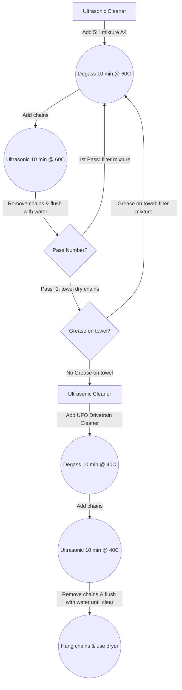

# Bicycle Chain Waxing

<!--
UPDATE
-->

-----

-----

## New Chain Cleaning

- Add 5:1 mixture of [elma tec clean A4](https://www.elma-ultrasonic.com/fileadmin/downloads/CleaningAgents/ProductInformation/EN/PI_elma%20tec%20clean%20A4_EN.pdf) to Ultrasonic Cleaner
- Degass for 10 minutes and heat mixture to 60 Celsius (140 Fahrenheit)
- Add new chains and run for 10 minutes
- Remove chains and flush with boiling water (2 times)
- Filter mixture and repeat above steps
- Remove chains and flush with boiling water (2 times)
- If towel drying chain shows grease on towel then repeat above steps
- Once towel drying shows no grease on towel, add [UFO Drivetrain Cleaner](https://ceramicspeed.com/products/ufo-drivetrain-cleaner-500-ml) to Ultrasonic Cleaner
- Degass for 10 minutes and heat mixture to 40 Celsius (104 Fahrenheit)
- Add chains and run for 10 minutes
- Remove chains and flush with boiling water until water is clear
- Hang chains and dry with hair dryer

-----

-----

## New Chain Waxing

- Add [MSPEEDWAX](https://moltenspeedwax.com/collections/molten-speed-wax/products/copy-of-molten-speed-wax-3-lbs) to `Slow Cooker` pot and heat to 93 Celsius (200 Fahrenheit)
- Add dried chain to `Slow Cooker` pot and wait until heat returns to the above temperature
- Swish chain in wax for 1 minute
- Remove chain and hang to dry
- Swish master link in wax
- Remove master link and dry

**Note:** Buy a Candy Thermometer and calibrate with boiling water.

-----

-----

## New Chain Preparation Prior Installation on Bike

- Break wax bond on chain by running chain over PVC pipe

-----

-----

## Chain installation

- Install chain
- Spin crank for 1 minute to further break wax bond
- Spin crank and change gears up and down for 1 minute
- Ride bike for 10 minutes to complete initial break in

**Note:** Chain may skip during the 10 minute ride break in period.

-----

-----

## Waxed Chain Maintenance at Home

- Flush with boiling water (2 times)
- Add 5:1 mixture of [elma tec clean A4](https://www.elma-ultrasonic.com/fileadmin/downloads/CleaningAgents/ProductInformation/EN/PI_elma%20tec%20clean%20A4_EN.pdf) to Ultrasonic Cleaner
- Degass for 10 minutes and heat mixture to 60 Celsius (140 Fahrenheit)
- Add chains and run for 10 minutes
- Remove chains and flush with boiling water until water is clear
- Hang chains and dry with hair dryer
- Follow [New Chain Waxing](Bicycle-Chain-Waxing.md#new-chain-waxing)

-----

-----

## Waxed Chain Maintenance away from home

**Note:** [Steps from Zero Friction Cycling](https://zerofrictioncycling.com.au/wp-content/uploads/2020/10/Lubricant-detail-review-Silca-super-secret-drip-v1.1.pdf) on use of Silca Super Secret Drip Lube.

- Be sure to have chain line relatively straight (53/15 or so).
- Shake bottle well and open tip halfway.
- Begin applying drip lube to top of rollers while pedalling backward. Be sure to apply at least 1 drop per roller and no more than 2 drops per roller while continuing to backpedal..
- Use fingers on top-bottom of chain to work the lube into rollers while back pedalling at least 3-4 revolutions.
- Pedal forward shifting all the way to top of the cassette, pedal for at least 3-4 revolutions. The extreme chain angle opens gaps between plates to allow the lube to better work into the chain. Continue pedalling, shifting through all gears on the rear cassette at least once.
- Stop pedalling and allow Secret Chain Lube to dry for minimum 2 hours, test results show that lube is fully hardened in 24 hours. ZeroFrictionCycling found SSCL to be best dry lube EVER Tested after 8 hours drying, but would be EVEN BETTER after 24 hours!!

**Note:** Once home, follow [Waxed Chain Maintenance at Home](Bicycle-Chain-Waxing.md#waxed-chain-maintenance-at-home)

-----

-----

## Master Link

- Reuse master link for up to 5 times
- Use a new link on 6th chain install

**Note:** Replace the master link prior to the 6th time if you notice that removal or install of master link is too easy.

-----

-----

## Replace Chain at 0.5% wear

- Use [Shimano TL-CN-42 checker](https://www.amazon.com/dp/B00DT01OBC?psc=1&ref=ppx_yo2ov_dt_b_product_details) to measure wear. Any other tool may give false reading.

**Notes:** 

- SRAM chains with “HARDCHROME” – so Force / Red or x01  xx1 – they are the hardiest wearing chains in the world by a large margin – no other chains wear resistance matches SRAM HARDCHROME wear protection.
- SRAM flat top chains have oversize rollers so you will get a false low wear measure. 0.5 on a Flat top chains is going to be circa 0.7 on a normal 11/128 standard chain. 

## Reference Links

- [Zero Friction Cycling](https://zerofrictioncycling.com.au/)
- [MSPEEDWAX: Why Wax](https://moltenspeedwax.com/pages/why-wax)
- [BikeRadar: Why I wax my chains](https://www.bikeradar.com/advice/workshop/how-to-wax-a-chain)

## Final Notes

- Wear safety glasses
- Naturalize and dispose of waste per your local area requirements

## Want Someone to do Initial Chain Cleaning and Wax?

- [MSPEEDWAX Chains](https://moltenspeedwax.com/collections/ybn-chains)
- [Zero Friction Cycling Bundle Pack](https://zerofrictioncycling.com.au/product-category/bundle/)

- [Contact me for other options](mailto:r26988@gmail.com)