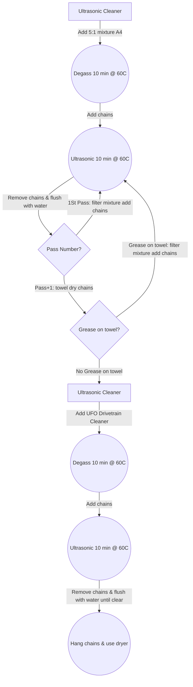

# Bicycle Chain Waxing

<!--
UPDATE
-->

-----

-----

## Overview of New Chain Cleaning

- Add 5:1 mixture of [elma tec clean A4](https://www.elma-ultrasonic.com/fileadmin/downloads/CleaningAgents/ProductInformation/EN/PI_elma%20tec%20clean%20A4_EN.pdf) to Ultrasonic Cleaner
- Degass for 10 minutes and heat mixture to 60 degrees Celsius (140 Fahrenheit)
- Add new chains and run for 10 minutes
- Remove chains and flush with boiling water (2 times)
- Filter mixture and repeat above steps
- Remove chains and flush with boiling water (2 times)
- If towel drying chain shows grease on towel then repeat above steps
- Once towel drying shows no grease on towel, add [UFO Drivetrain Cleaner](https://ceramicspeed.com/products/ufo-drivetrain-cleaner-500-ml) to Ultrasonic Cleaner
- Degass for 10 minutes and heat mixture to 60 degrees Celsius (140 Fahrenheit)
- Add chains and run for 10 minutes
- Remove chains and flush with boiling water until water is clear
- Hang chains and dry with hair dryer

-----

-----

## Overview of New Chain Waxing

- Add [MSPEEDWAX](https://moltenspeedwax.com/collections/molten-speed-wax/products/copy-of-molten-speed-wax-3-lbs) to `Slow Cooker` pot and heat to 88 degrees Celsius (190 Fahrenheit)
- Add dried chain to CROC pot and wait until heat returns to above temperature
- Swish chain in wax for 1 minute
- Remove chain and hang to dry

-----

-----

## Overview of New Chain Preparation Prior Installation on Bike

- Break wax bond on chain by running chain over PVC pipe

-----

-----

## Chain installation

- Install chain
- Spin crank for 1 minute to further break wax bond
- Spin crank and change gears up and down for 1 minute
- Ride bike for 10 minutes to complete initial break in

**Note:** Chain may skip during the 10 minute ride break in period.

-----

-----

## Reference Links

- [Zero Friction Cycling](https://zerofrictioncycling.com.au/)
- [MSPEEDWAX: Why Wax](https://moltenspeedwax.com/pages/why-wax)
- [BikeRadar: Why I wax my chains](https://www.bikeradar.com/advice/workshop/how-to-wax-a-chain)