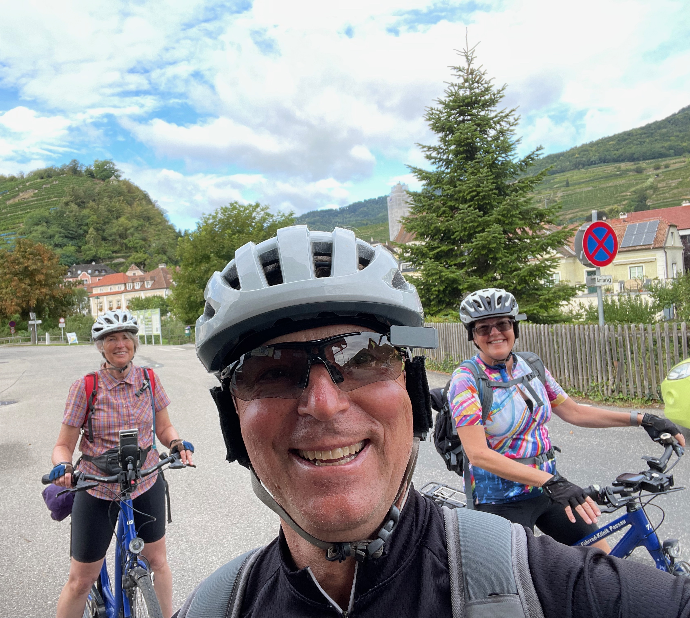
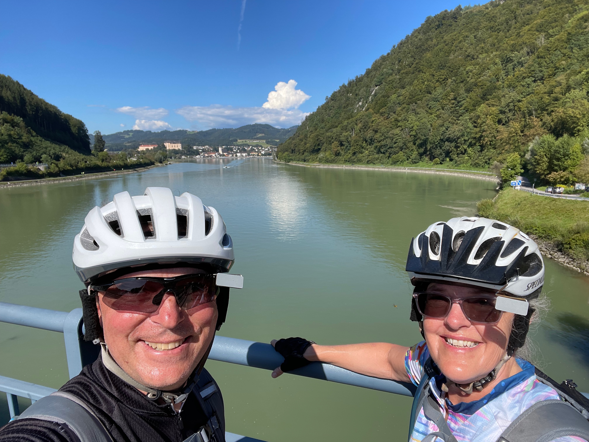
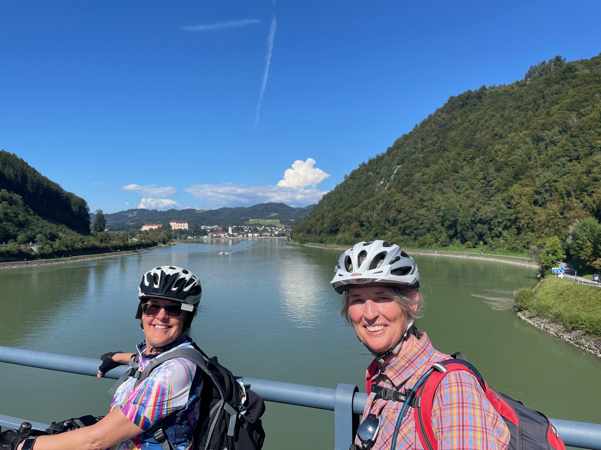

# Rides and Videos

<!--
UPDATE
<video controls>
<source src="../videos/HOWTO-Add-Applications-IGEL_OS_12_wo_UMS_AppPortal.mp4" type="video/mp4">
</video>
-->

-----

-----

## Rides

- [Collection of Loveland Colorado Rides](https://ridewithgps.com/collections/3162931)
- [Fall colors on ride to top of Santa Fe Ski Area](https://www.strava.com/activities/12527246015)
- [Molas Lake to Telluride via Ophir Pass](https://www.strava.com/activities/12174252026)

<iframe src="https://ridewithgps.com/embeds?type=route&id=48000740&sampleGraph=true&distanceMarkers=true&showPhotos=true" style="width: 1px; min-width: 100%; height: 700px; border: none;" scrolling="no"></iframe>

- [Rocky Mountain National Park - Old Falls River Loop](https://www.strava.com/activities/11817194527)

<iframe src="https://ridewithgps.com/embeds?type=route&id=47419506&sampleGraph=true&distanceMarkers=true&showPhotos=true" style="width: 1px; min-width: 100%; height: 700px; border: none;" scrolling="no"></iframe>

- [Loop around Sandias](https://www.strava.com/activities/10179981317)
- [Gilman Tunnels](https://www.strava.com/activities/9635956540)

<iframe src="https://ridewithgps.com/embeds?type=route&id=44024279&sampleGraph=true&distanceMarkers=true&showPhotos=true" style="width: 1px; min-width: 100%; height: 700px; border: none;" scrolling="no"></iframe>

- [Caldera Crest Trail](https://www.trailforks.com/trails/caldera-crest-trail/)
- [Go West young man.. Well I’m getting older but don’t feel it.](https://www.strava.com/activities/10459102374)
- [Today’s history lesson’s and a white bike.](https://www.strava.com/activities/10110780858)
- [Morning Ride with Tommy. Forgot to unpause at the top.](https://www.strava.com/activities/10087193041)
- [Not so easy route to the lazy lizard.](https://www.strava.com/activities/9958735844)
- [North Albuquerque](https://www.strava.com/activities/10016118623)
- [South Albuquerque](https://www.strava.com/activities/9940294908)

-----

-----

## Videos

- [Fall colors on ride to top of Santa Fe Ski Area - 240928](https://youtu.be/FQxCcJpoLhk)
- [Molas Lake to Telluride via Ophir Pass - 240817](https://youtu.be/95h8Jhez-yc)
- [Sand surfing](https://youtu.be/EdIwXk2kRc4?si=VF5rh4u7WfWpgzD2)
- [Jemez - Bike Packing - Day 1 - 230715](https://youtu.be/FYII_S_Hcqs?si=aZFUwIEhWy9Qgy66)
- [Jemez - Bike Packing - Day 2 - 230716](https://youtu.be/JpMxcMa8OM4?si=i4hicsAcyzzVSOhz)
- [Terraform Backyard - Part 1](https://youtu.be/bS7sgh5xDwM?si=FOjVlpPx_NH8jQVn)
- [Terraform Backyard - Part 2](https://youtu.be/sKPluSoEnXI?si=wgVdKXDEE7jrDnGF)
- [Gilman Tunnels Loop](https://youtu.be/BH3MiV6nWh4?si=JnFpp0Qz_sCIcu7g)
- [Mount Taylor - Bike Packing - 240601-02](https://youtu.be/9hoCJsxpCWo)
- [Santa Fe Area - Part 1 - 240608](https://youtu.be/pjaa4q-WLSA)
- [Santa Fe Area - Part 2 - 240608](https://youtu.be/7jMtdkwnXxY)
- [Estes Rocky Mountain Lower Loop with Chasm Falls - 240617](https://youtu.be/iBjIhGd4CV0)
- [Rocky Mountain National Park - Old Falls River Loop - 240705](https://youtu.be/UU8sLd_voBI)

-----

-----

## Danube from Passau to Vienna

**Summary:** Flew into Munich, took train to Passau, rented bikes in Passau, rode to Vienna, dropped off bikes, took train back to Munich, experienced Oktoberfest, and then flew home.

- [Day 1 - Passau to Aschach](https://www.strava.com/activities/9854832339)
- [Day 2 - Aschach to Mauthausen](https://www.strava.com/activities/9860710343)
- [Day 3 - Mauthausen to Ybbs](https://www.strava.com/activities/9868959003)
- [Day 4 - Ybbs to Spitz](https://www.strava.com/activities/9875119944)
- [Day 4 - Hike to Castle](https://www.strava.com/activities/9875119778)
- [Day 5 - Spitz to Tulln](https://www.strava.com/activities/9879722065)
- [Day 6 - Tulln to Vienna](https://www.strava.com/activities/9885616836)
- [Day 6 - Afternoon Walk in Vienna](https://www.strava.com/activities/9886466537)

