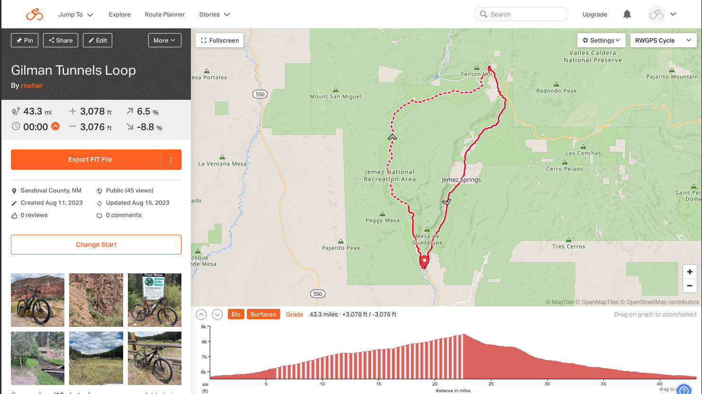
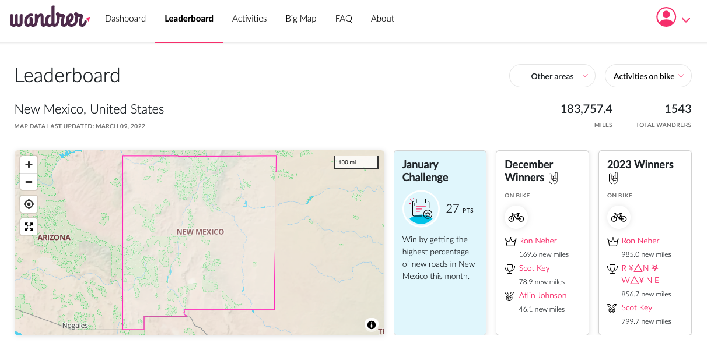
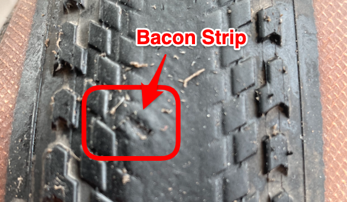
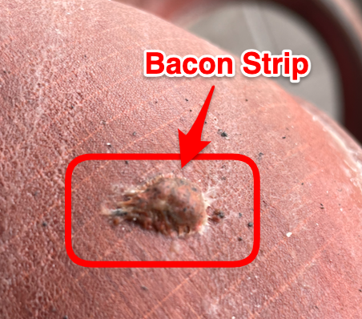

# Neher

`"one bike ride away from figuring it all out" - Tom Ritchey`

`"My bikes are my medical devices, they measure my lack of fitness and how out of shape I am!" - anonymous`

`"A million years from now only three things will remain: cockroaches, Hostess Twinkies, and vi." - anonymous`

Neher is a repository hosting of my documentation. This documentation is without any warranty or support.

----------

----------

<!---
Comment

https://squidfunk.github.io/mkdocs-material/setup/setting-up-site-analytics/

https://analytics.google.com/analytics/web/#/p431202354/reports/intelligenthome

Stream Name: Neher-Bike
Stream URL: https://rneher-igel.github.io/Neher/
Stream ID: 7617549146
Measurement Id: G-9LJPNGE4R5
-->

## Bicycle

- [Chain Waxing](Docs/Bicycle-Chain-Waxing.md)
- [Route Planning via Ride with GPS](https://ridewithgps.com/)

- [Become a Wanderer](https://wandrer.earth/about)

    - [How to use the Wandrer browser extension](https://wandrer.earth/install_extension)

### Routing with Garmin

**NOTE:** [Manage and Update Your Garmin Device](https://www.garmin.com/en-US/software/express)

- Use [RidewithGPS](https://ridewithgps.com/routes/new) with the [Wandrer Map Overlay](https://wandrer.earth/install_extension)
- Save the route as a fit file to your PC
- Connect Garmin to PC via USB data cable (If it does not mount, your USB cable may only be used for charging)
- Copy the fit file to the Garmin `NewFiles` folder `(/GARMIN/Garmin/NewFiles)`
- Unmount the Garmin from PC
- Disconnect Garmin from PC USB cable
- Additional notes can be found in [Garmin Edge 530 - Courses](https://www8.garmin.com/manuals/webhelp/edge530/EN-US/GUID-7416CBA5-CEA0-45A5-B7D8-4D9B36419E6B.html)
- Additional notes can be found in [Garmin Edge 540 - Courses](https://www8.garmin.com/manuals/webhelp/GUID-17DE938E-466A-4746-BDBF-7A6FC1B3A32C/EN-US/GUID-7416CBA5-CEA0-45A5-B7D8-4D9B36419E6B.html)
- Additional notes can be found in [Garmin Edge 840 - Courses](https://www8.garmin.com/manuals/webhelp/GUID-16B12CFE-F96E-4DE9-9F5F-8C4A5936D3B9/EN-US/GUID-7416CBA5-CEA0-45A5-B7D8-4D9B36419E6B.html)

### Tubeless road tires

- As with any tech, shifting (friction vs. indexed) or brakes (rim vs. disc), tubeless road tires require some education and practice on setup, maintenance (monitor and add sealant as needed), and how to fix on the road and at home. All of my bikes are now tubeless except for one road bike that does not have tubeless ready rims. On that road bike I use tubes with removable valve cores and put Stans sealant in the tubes.

### Road Tires with Tubes

- For my road bikes with tubes, I run Continental Gator Hardshell (28MM), tubes with removable valve cores, Stans sealant in the tubes, and 80 PSI pressure. I top off with Stans (1 oz) every couple of months. Over two years without a flat in New Mexico. 

- [Continental Gator Hardshell](https://www.bicyclerollingresistance.com/road-bike-reviews/continental-gator-hardshell)
- [Stans Sealant in Tube](https://www.notubes.com/support-center/sealant)

- **Q:** Can I add sealant to my tubes or tubular tires?
- **A:** Yes, if the tube or tubular has a removable valve core. If there are two opposing flat surfaces just below the top of the valve, you can use our valve tool to unthread the core and sealant can be installed. We recommend injecting 1-2 ounces (30-60ml) of sealant into tubes or tubular tires. Sealant will not damage tubular tires.

### Use of e-road bikes on group rides for sag wagon support:

- Carries extra water, tubes, food, clothes, etc.
- Drops back (on climbs, windy days) to pace dropped riders (mechanical / flats) back to the group 
- Does most of the pace setting on windy  segments / days
- If just riding with a group of non e-assistance riders and not providing sag support then expect to use 8% of your battery per 40 miles

### Equipment

- [Base layers](https://merino.tech/)
- [Bike Chain Sleeve](http://www.whitelightningco.com/products/johnnys/chain-johnny)
- [Bike Computers - Garmin](https://www.garmin.com/en-US/c/sports-fitness/cycling-bike-computers-bike-radar-power-meter-headlights)
- [Bike Packing Rack](https://aeroe.com/)
- [Bike Rack - 1UP](https://1up-usa.com/)
- [Bike Rack - Saris](https://saris.com/collections/racks)
- [Bike Repair Stand](https://feedbacksports.com/collections/bike-repair-stands/products/ultralight-bike-repair-stand?variant=44214811296042)
- [Bike Saddle](https://www.bobcatbicycles.com/product/specialized-power-comp-232349-1.htm)
- [Bike Wheel Turing Stand](https://feedbacksports.com/collections/bike-maintenance/products/pro-truing-stand-2-0?variant=44400748233002)
- [Cycling Clothing for Long Lasting Comfort](https://www.boure.com/index.html)
- [Cycling Mirror](https://takealookactive.com/)
- [Digital Caliper](https://www.amazon.com/dp/B07X8JQ8L5?ref=ppx_yo2ov_dt_b_product_details&th=1)
- [Disc Brake Pads - TruckerCo](https://www.truckerco.com/disc-brake-pads-retail)
- [Mahle X20](https://mahle-smartbike.com/news-event/experience-next-level-cycling-with-the-orbea-gain-ebike-and-mahle-x20-system/)
- [Pedals](https://www.crankbrothers.com/collections/eggbeater/products/eggbeater-1?variant=53958723335)
- [Pump](https://www.fumpapumps.com/products/fumpa-bike-pump)
- [Shoes](https://www.crankbrothers.com/products/mallet-e-lace-black-blue?variant=39315475202144#grouped-product-input)
- [Traffic Cone Bag](https://trafficconebag.blogspot.com/p/traffic-cone-bag-101.html)
- [Tubeless Sealant](https://www.notubes.com/stan-s-tire-sealant-quart)
- [Wool Cycling Jerseys](https://www.oregoncyclewear.com/woolcyclingjerseys.html)

### My Bikes

- [Bike Friday Super Pro](https://bikefriday.com/bike-models/)
- [Borelais Crestone](https://fatbike.com/collections/crestone-builds/products/crestone-custom-sram)
- [Orbea Gain](https://www.orbea.com/us-en/ebikes/road/gain/)
- [Orbea Oiz](https://www.orbea.com/us-en/bicycles/mountain/oiz/)
- [Trek Émonda](https://www.trekbikes.com/us/en_US/emonda/)

### My Links

- [BBBike Garmin Custom Map Extracts](https://extract.bbbike.org/garmin.html)
- [Bicycle Rolling Resistance](https://www.bicyclerollingresistance.com/)
- [Bike Packing](https://bikepacking.com/)
- [Bike Registry](https://project529.com)
- [Bike Shop - Austin, TX](https://velorangutan.com/)
- [Bike Shop - Corrales, NM](https://www.fattirecycles.com/)
- [Bike Shop - Loveland, CO](https://www.breakaway-cycles.com/)
- [Bike Tires Direct](https://www.biketiresdirect.com/)
- [Bike Tools Etc!](https://www.biketoolsetc.com/)
- [NiteRider Technical Lighting](https://www.niterider.com/)
- [Park Tool: Chain Length Sizing](https://www.parktool.com/en-us/blog/repair-help/chain-length-sizing)
- [Road Bike Rider](https://www.roadbikerider.com/)
- [Russ McCoy - Coaching](https://russmccoy.wixsite.com/russmccoy)
- [Russ McCoy - New Mexico Cycling](https://russmccoy.wixsite.com/newmexicocycling)
- [SRAM Brake Pads - Which SRAM brake pads do you need? - When to replace pads and rotors](https://www.sram.com/en/service/articles/SRAM-Brake-Pad-Overview)
- [SRAM Drivetrain Adjustment Tool](https://www.sram.com/globalassets/document-hierarchy/service-manuals/sram-drivetrain-adjustment-tools.pdf)
- [SRAM Tire Pressure](https://axs.sram.com/guides/tire/pressure)
- [Strava](https://www.strava.com/)
- [TrailForks](https://www.trailforks.com/about/)

**NOTES:**

- [Replace brake pads when material and backer plate is 3MM or less (measure with digital caliper)](https://www.sram.com/en/service/articles/SRAM-Brake-Pad-Overview)
- [Replace brake rotor when rotor track thickness is 1.55MM or less (measure with digital caliper)](https://www.sram.com/en/service/articles/SRAM-Brake-Pad-Overview)
- [Replace Chain at 0.5% wear](Docs/Bicycle-Chain-Waxing.md#replace-chain-at-05-wear)
- [Torque Specifications and Concepts](https://www.parktool.com/en-us/blog/repair-help/torque-specifications-and-concepts)

### Nutrition Advice

- I would recommend a balanced intake of carbs, fatty acids and electrolytes with a hypotonic drink -- A beer and a packet of chips.

### [Pictures, Rides and Videos](Docs/Pictures-and-Videos.md)

----------

----------

## QR Code

- neher-bike

- neher-bike-chain-waxing

----------

----------

## 2023 Orbea Gain M21E

[Orbea Gain 2023 M21E](https://www.orbea.com/us-en/ebikes/road/gain/technology) —- **Bike build:** My O custom color, Carbon OMR, Mahle X20 with iX350 battery and E-Shifters, SRAM Force eTap AXS, 40t chainring, 10-44T cassette, tubeless Pirelli Cinturato Gravel H 35mm, bike weight 28 pounds / 12.72 kg.

### Comments:

- Don't worry about the weight (bike and you)
- Setup tires tubeless (I use [Stans sealant](https://www.notubes.com/stan-s-tire-sealant-quart) and bacon strips to plug larger holes)
- Use tire pressure gauge and [SRAM app for tire pressure](https://axs.sram.com/guides/tire/pressure)
- Use power mode one to come up to speed and then to zero
- Use power modes as needed to manage effort / speed
- Recharge if needed for next planned ride
- If just riding with a group of non e-assistance riders and not providing sag support then expect to use 8% of your battery per 40 miles
- The [Mahle X20 hub system](https://mahle-smartbike.com/x20/) smoothly provides torque that mirrors your input and feels like you always have a nice tailwind vs. crank / mid drive that feels like someone is pulling you along.
- The [Mahle eShifters](https://mahle-smartbike.com/eshifters/) allows for quick power adjustment from off to levels one, two, and three.

<!---
Comment
### QR Codes

- Foo

-->

<a style="display:inline-block;background-color:#FC5200;color:#fff;padding:5px 10px 5px 30px;font-size:11px;font-family:Helvetica, Arial, sans-serif;white-space:nowrap;text-decoration:none;background-repeat:no-repeat;background-position:10px center;border-radius:3px;background-image:url('https://badges.strava.com/logo-strava-echelon.png')" href='https://strava.com/athletes/ron_neher' target="_clean">
  Follow me on
  
</a>